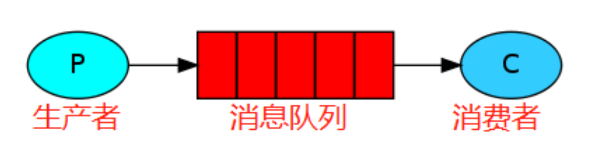

# RabbiMQ

## 1.基本概念

### 1.1.什么是消息队列

>1. 消息队列是一种用于在应用程序之间传递消息的通信方式，消息队列允许应用程序异步的发送和接收消息，并且不需要直接连接到对方。(消息队列的目的是为了实现各个 APP 之间的通讯，APP 基于 MQ 实现消息的发送和接收实现应用程序之间的通讯，这样多个应用程序可以运行在不同的主机上，通过 MQ 就可以实现夸网络通信，因此 MQ 实现了业务的解耦和异步机制。)
>2. 消息指的是两个应用间传递的数据。数据的类型有很多种形式，可能只包含文本字符串，也可能包含嵌入对象。
>3. 队列指的是存储数据的介质，遵循先进先出的规则。

### 1.2.MQ使用场景

消息队列作为高并发系统的核心组件之一，能够帮助业务系统结构提升开发效率和系统稳定性，消息队列主要具有以下特点：

1. **解耦：** 在传统模式下，假设新增物流系统模块，则需要订单系统新增调用物流系统的代码逻辑。假设库存系统异常，订单系统调用出错，会导致整个服务不可用。为了降低这种强耦合，就可以使用MQ，系统订单系统只需要把数据发送到MQ，其他系统如果需要数据，则从MQ中获取即可。
2. **异步：**比如在进行用户注册时，会进行写入数据库、发送邮件、发送短信操作。同步请求的话，响应时间就是所有操作步骤时间的总和，也就是1s。如果使用MQ，用户模块发送数据到MQ，然后就可以返回响应给客户端，不需要再等待系统其他操作的响应，可以大大地提高性能。对于一些非必要的业务，比如发送短信，发送邮件等等，就可以采用MQ。
3. **削峰：**假设系统A在某一段时间请求数暴增，有5000个请求发送过来，系统A这时就会发送5000条SQL进入MySQL进行执行，MySQL对于如此庞大的请求当然处理不过来，MySQL就会崩溃，导致系统瘫痪。如果使用MQ，系统A不再是直接发送SQL到数据库，而是把数据发送到MQ，MQ短时间积压数据是可以接受的，然后由消费者每次拉取2000条进行处理，防止在请求峰值时期大量的请求直接发送到MySQL导致系统崩溃。

## 2.RabbitMQ的特点

RabbitMQ是一款使用Erlang语言开发的，实现AMQP(高级消息队列协议)的开源消息中间件。、

1. 可靠性。支持持久化，传输确认，发布确认等保证了MQ的可靠性；
2. 灵活的分发消息策略。这应该是RabbitMQ的一大特点。在消息进入MQ前由Exchange(交换机)进行路由消息。分发消息策略有：简单模式、工作队列模式、发布订阅模式、路由模式、通配符模式；
3. 支持集群。多台RabbitMQ服务器可以组成一个集群，形成一个逻辑Broker，多种协议。RabbitMQ支持多种消息队列协议，比如 STOMP、MQTT 等等；
4. 支持多种语言客户端。RabbitMQ几乎支持所有常用编程语言，包括 Java、.NET、Ruby 等等；
5. 可视化管理界面。RabbitMQ提供了一个易用的用户界面，使得用户可以监控和管理消息 Broker；

>:bell:总而言之：
>
>1. 消息基于先进先出的原则进行顺序消费，可以持久化到磁盘节点服务器，可以缓存到内存节点服务器提高性能；
>2. 基于 erlang 语言开发，具有高并发优点、支持分布式，
>3. 具有消息确认机制、消息持久化机制，消息可靠性和集群可靠性高，简单易用、运行稳定、跨平台、开源。

## 3.RabbitMQ架构原理