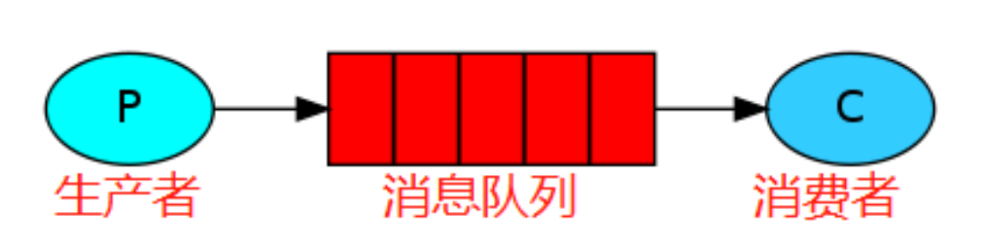
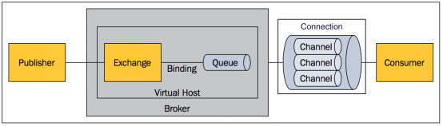
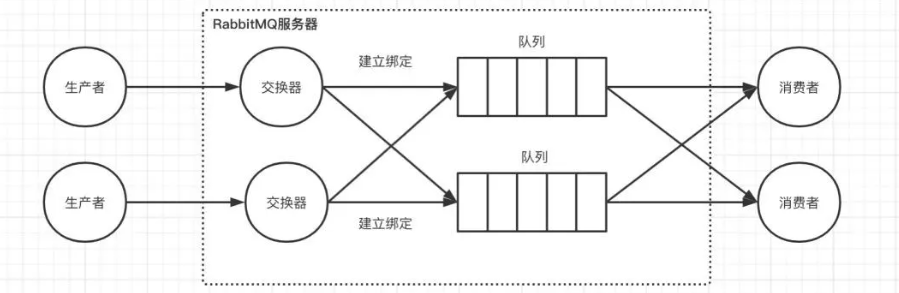

# RabbitMQ

## 1.基本概念

### 1.1.什么是消息队列

>1. 消息队列是一种用于在应用程序之间传递消息的通信方式，消息队列允许应用程序异步的发送和接收消息，并且不需要直接连接到对方。(消息队列的目的是为了实现各个 APP 之间的通讯，APP 基于 MQ 实现消息的发送和接收实现应用程序之间的通讯，这样多个应用程序可以运行在不同的主机上，通过 MQ 就可以实现夸网络通信，因此 MQ 实现了业务的解耦和异步机制。)
>2. 消息指的是两个应用间传递的数据。数据的类型有很多种形式，可能只包含文本字符串，也可能包含嵌入对象。
>3. 队列指的是存储数据的介质，遵循先进先出的规则。

### 1.2.MQ使用场景

消息队列作为高并发系统的核心组件之一，能够帮助业务系统结构提升开发效率和系统稳定性，消息队列主要具有以下特点：

1. **解耦**： 在传统模式下，假设新增物流系统模块，则需要订单系统新增调用物流系统的代码逻辑。假设库存系统异常，订单系统调用出错，会导致整个服务不可用。为了降低这种强耦合，就可以使用MQ，系统订单系统只需要把数据发送到MQ，其他系统如果需要数据，则从MQ中获取即可。
2. **异步**：比如在进行用户注册时，会进行写入数据库、发送邮件、发送短信操作。同步请求的话，响应时间就是所有操作步骤时间的总和，也就是1s。如果使用MQ，用户模块发送数据到MQ，然后就可以返回响应给客户端，不需要再等待系统其他操作的响应，可以大大地提高性能。对于一些非必要的业务，比如发送短信，发送邮件等等，就可以采用MQ。
3. **削峰**：假设系统A在某一段时间请求数暴增，有5000个请求发送过来，系统A这时就会发送5000条SQL进入MySQL进行执行，MySQL对于如此庞大的请求当然处理不过来，MySQL就会崩溃，导致系统瘫痪。如果使用MQ，系统A不再是直接发送SQL到数据库，而是把数据发送到MQ，MQ短时间积压数据是可以接受的，然后由消费者每次拉取2000条进行处理，防止在请求峰值时期大量的请求直接发送到MySQL导致系统崩溃。

## 2.RabbitMQ的特点

RabbitMQ是一款使用Erlang语言开发的，实现AMQP(高级消息队列协议)的开源消息中间件。

1. 可靠性。支持持久化，传输确认，发布确认等保证了MQ的可靠性；
2. 灵活的分发消息策略。这应该是RabbitMQ的一大特点。在消息进入MQ前由Exchange(交换机)进行路由消息。分发消息策略有：简单模式、工作队列模式、发布订阅模式、路由模式、通配符模式；
3. 支持集群。多台RabbitMQ服务器可以组成一个集群，形成一个逻辑Broker，多种协议。RabbitMQ支持多种消息队列协议，比如 STOMP、MQTT 等等；
4. 支持多种语言客户端。RabbitMQ几乎支持所有常用编程语言，包括 Java、.NET、Ruby 等等；
5. 可视化管理界面。RabbitMQ提供了一个易用的用户界面，使得用户可以监控和管理消息 Broker。

>:bell:**简而言之：**
>
>1. 消息基于先进先出的原则进行顺序消费，可以持久化到磁盘节点服务器，可以缓存到内存节点服务器提高性能；
>2. 基于 erlang 语言开发，具有高并发优点、支持分布式，
>3. 具有消息确认机制、消息持久化机制，消息可靠性和集群可靠性高，简单易用、运行稳定、跨平台、开源。

### 2.1.消息队列中间件对比

目前在市面上比较主流的MQ中间件主要有，ActiveMQ、RabbitMQ、Kafka、RocketMQ 等这几种，对比如下表：

| 特性             | ActiveMQ                                     | RabbitMQ                                               | Kafka                                                        | RocketMQ                                                     |
| :--------------- | :------------------------------------------- | :----------------------------------------------------- | :----------------------------------------------------------- | :----------------------------------------------------------- |
| 所属社区/公司    | Apache                                       | Mozilla Public License                                 | Apache                                                       | Apache/Ali                                                   |
| 单机呑吐量       | 万级                                         | 万级                                                   | 几十万级                                                     | 十万级                                                       |
| 时效性           | 毫秒级                                       | 微秒级                                                 | 毫秒级                                                       | 毫秒级                                                       |
| 可用性           | 主从                                         | 主从                                                   | 分布式                                                       | 分布式                                                       |
| 功能特性         | MQ领域功能极其完备                           | 基于erlang开发，所以并发能力很强，性能极其好，延时很低 | 功能较为简单，主要支持简单的MQ功能，在大数据领域的实时计算以及日志采集被大规模使用 | MQ功能比较完备，扩展性佳                                     |
| 消息可靠性       | 有较低的概率丢失数据                         | 基本不丢                                               | 经过参数优化配置，可以做到 0 丢失                            | 同 Kafka                                                     |
| 事务             | 支持                                         | 不支持                                                 | 支持                                                         | 支持                                                         |
| broker端消息过滤 | 支持                                         | 不支持                                                 | 不支持                                                       | 可以支持Tag标签过滤和SQL表达式过滤                           |
| 消息查询         | 支持                                         | 根据消息id查询                                         | 不支持                                                       | 支持Message id或Key查询                                      |
| 消息回溯         | 支持                                         | 不支持                                                 | 理论上可以支持时间或offset回溯，但是得修改代码。             | 支持按时间来回溯消息，精度毫秒，例如从一天之前的某时某分某秒开始重新消费消息。 |
| 路由逻辑         | 无                                           | 基于交换机，可配置复杂路由逻辑                         | 根据topic                                                    | 根据topic，可以配置过滤消费                                  |
| 持久化           | 内存、文件、数据库                           | 队列基于内存，只能少量堆积                             | 磁盘，大量堆积                                               | 磁盘，大量堆积                                               |
| 顺序消息         | 支持                                         | 不支持                                                 | 支持                                                         | 支持                                                         |
| 社区活跃度       | 低                                           | 中                                                     | 高                                                           | 高                                                           |
| 适用场景         | 解耦和异步调用，较少在大规模吞吐的场景中使用 | 数据量小对时效性要求高的场景中使用                     | 大数据类的系统来进行实时数据计算、日志采集等场景。           | 目前在阿里被广泛应用在订单、交易、充值、流计算、消息推送、日志流式处理、binglog分发消息等场景。 |

## 3.RabbitMQ架构原理

### 3.1.内部结构

1. Publisher：消息的生产者，也是一个向交换器发布消息的客户端应用程序。
2. Exchange：交换器，用来接收生产者发送的消息并将这些消息路由给服务器中的队列。
3. Binding：绑定，用于将消息队列和交换器之间建立关联。一个绑定就是基于路由键将交换器和消息队列连接起来的路由规则，所以可以将它理解成一个由绑定构成的路由表。
4. Queue：消息队列，用来保存消息直到发送给消费者。
5. Connection：网络连接，比如一个 TCP 连接。
6. Channel：信道，多路复用连接中的一条独立的双向数据流通道
7. Consumer：消息的消费者，表示一个从消息队列中取得消息的客户端应用程序
8. Virtual Host：虚拟主机，表示一批交换器、消息队列和相关对象。虚拟主机是共享相同的身份认证和加密环境的独立服务器域。每个 vhost 本质上就是一个 mini 版的 RabbitMQ 服务器，拥有自己的队列、交换器、绑定和权限机制。vhost 是 AMQP 概念的基础，必须在连接时指定，RabbitMQ 默认的 vhost 是 `/`
9. Broker：表示消息队列服务器实体
10. Message：消息实体，它由消息头和消息体组成。消息头主要由路由键、交换器、队列、priority（相对于其他消息的优先权）、delivery-mode（指出该消息可能需要持久性存储）等属性组成，而消息体就是指具体的业务对象。

>1. 相比传统的 JMS 模型，AMQP 主要多了 **Exchange**、**Binding** 这个新概念。
>2. 在 AMQP 模型中，消息的生产者不是直接将消息发送到`Queue`队列，而是将消息发送到`Exchange`交换器，其中还新加了一个中间层`Binding`绑定，作用就是通过`路由键Key`将交换器和队列建立绑定关系。

>就好比类似**用户表**和**角色表**，中间通过**用户角色表**来将用户和角色建立关系，从而实现关系绑定，在 RabbitMQ 中，消息生产者不直接跟队列建立关系，而是将消息发送到交换器之后，由交换器通过已经建立好的绑定关系，将消息发送到对应的队列！

RabbitMQ 最终的架构模型，核心部分就变成如下图所示：

>从图中很容易看出，与 JMS 模型最明显的差别就是消息的生产者不直接将消息发送给队列，而是由`Binding`绑定决定交换器的消息应该发送到哪个队列，进一步实现了在消息的推送方面，更加灵活！

### 3.2.交换器分发策略

>当消息的生产者将消息发送到交换器之后，是不会存储消息的，而是通过中间层绑定关系将消息分发到不同的队列上，其中交换器的分发策略分为四种：Direct、Topic、Headers、Fanout！

1. **Direct**：直连类型，即在绑定时设定一个 routing_key, 消息的 routing_key 匹配时, 才会被交换器投送到绑定的队列中去，原则是**先匹配、后投送**；
2. **Topic**：按照规则转发类型，支持通配符匹配，和 Direct 功能一样，但是在匹配 routing_key的时候，更加灵活，支持通配符匹配，原则也是**先匹配、后投送**；
3. **Headers**：头部信息匹配转发类型，根据消息头部中的 header attribute 参数类型，将消息转发到对应的队列，原则也是**先匹配、后投送**；
4. **Fanout**：广播类型，将消息转发到所有与该交互机绑定的队列上，不关心 routing_key；

#### 3.2.1.Direct

1. Direct 是 RabbitMQ 默认的交换机模式，也是最简单的模式，消息中的路由键（routing key）如果和 Binding 中的 binding key 一致， 交换器就将消息发到对应的队列中。
2. 如果传入的 routing key 为 `black`，不会转发到`black.green`。Direct 类型交换器是完全匹配、单播的模式。
3. 特点：完全匹配

#### 3.2.2.Topic

1. Topic 类型交换器转发消息和 Direct 一样，不同的是：它支持通配符转发，相比 Direct 类型更加灵活！
2. 两种通配符：`*`只能匹配一个单词，`#`可以匹配零个或多个。
3. 如果传入的 routing key 为 `black#`，不仅会转发到`black`，也会转发到`black.green`。
4. 特点：支持通配符匹配

#### 3.2.3.Headers

1. headers 也是根据规则匹配, 相比 direct 和 topic 固定地使用 routing_key , headers 则是通过一个自定义匹配规则的消息头部类进行匹配。
2. 在队列与交换器绑定时，会设定一组键值对规则，消息中也包括一组键值对( headers 属性)，当这些键值对有一对, 或全部匹配时，消息被投送到对应队列。
3. 此外 headers 交换器和 direct 交换器完全一致，但性能差很多，目前几乎用不到了。
4. 特点：通过消息头部键值对匹配

#### 3.2.4.Fanout

1. Fanout  类型交换器与上面几个不同，不管路由键或者是路由模式，会把消息发给绑定给它的全部队列，如果配置了 routing_key 会被忽略，也被成为消息广播模式。很像子网广播，每台子网内的主机都获得了一份复制的消息
2. fanout 类型转发消息在四种类型中是最快的。
3. 特点：会忽略路由key，将消息发送给所有与交换器绑定的队列

