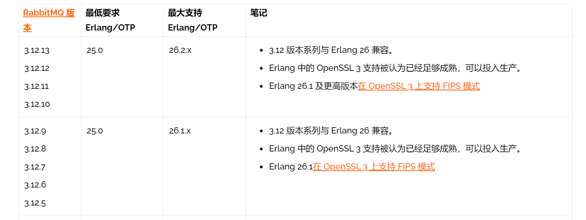
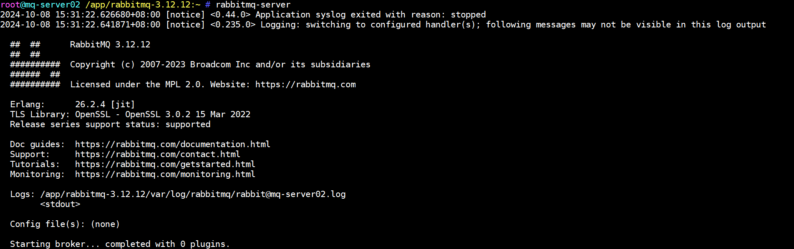
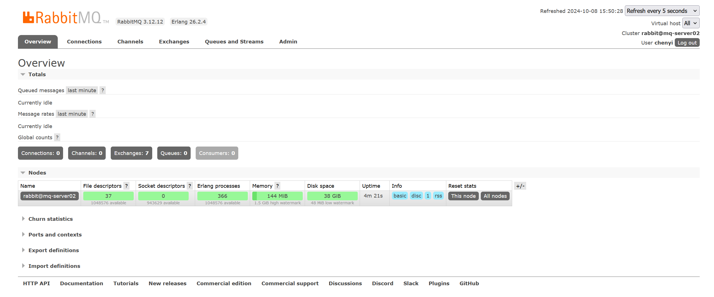

# RabbitMQ单节点部署

## 1.基础环境检查

1. RabbitMQ是采用 Erlang语言开发的，所以系统环境必须提供 Erlang环境，需要是安装 Erlang
2. `Erlang`和`RabbitMQ`版本对照：https://www.rabbitmq.com/docs/which-erlang
3. 本次安装3.12.12版本的RabbitMQ，需要的Erlang版本为26.2.4，

## 1.1.下载软件

>:mag:Erlang：https://github.com/erlang/otp/releases/download/OTP-26.2.4/otp_src_26.2.4.tar.gz
>
>:mag:RabbitMQ：https://github.com/rabbitmq/rabbitmq-server/releases/download/v3.12.12/rabbitmq-server-generic-unix-3.12.12.tar.xz

~~~shell
root@mq-server02 /opt:~ # wget https://github.com/erlang/otp/releases/download/OTP-26.2.4/otp_src_26.2.4.tar.gz

root@mq-server02 /opt:~ # wget https://github.com/rabbitmq/rabbitmq-server/releases/download/v3.12.12/rabbitmq-server-generic-unix-3.12.12.tar.xz

## 安装依赖 GCC 和 make 工具来编译源代码，以及一些基础库。
root@mq-server02 /opt/otp_src_26.2.4:~ # apt update
root@mq-server02 /opt/otp_src_26.2.4:~ # apt install -y build-essential tcl

## 对于 Ubuntu/Debian 系统，运行：
root@mq-server02 /opt/otp_src_26.2.4:~ # apt install -y libncurses5-dev libncursesw5-dev pkg-config  libssl-dev libncurses5-dev

## 对于 CentOS/RHEL 系统，运行：
yum install ncurses-devel
~~~

## 1.2.目前权限基础

>:bell:根据具体需求而定

| 文件系统   | 备注         | 格式化类型 | 容量 | 所属用户         | 所属用户组       | 权限 |
| ---------- | ------------ | ---------- | ---- | ---------------- | ---------------- | ---- |
| /appbackup | 备份目录     | XFS        | 50G  | rabbitmq（2579） | rabbitmq（2579） | 755  |
| /app       | 应用程序目录 | XFS        | 10G  | rabbitmq（2579） | rabbitmq（2579） | 755  |

~~~shell
## 1.创建用户和组
root@mq-server02 /opt:~ # groupadd -g 2579 rabbitmq
root@mq-server02 /opt:~ # useradd -u 2579 -g 2579 rabbitmq
root@mq-server02 /opt:~ # id rabbitmq
uid=2579(rabbitmq) gid=2579(rabbitmq) groups=2579(rabbitmq)

## 2.创建目录
root@mq-server02 /opt:~ #  mkdir -pv /app /app/erlang  /appbackup

## 3.创建文件系统
## 3.创建文件系统
root@mq-server02 /opt:~ #  vgcreate  datavg /dev/sdb /dev/sdc
root@mq-server02 /opt:~ #  lvcreate  -L 200G -n lv_app datavg 
root@mq-server02 /opt:~ #  mkfs.xfs /dev/datavg/lv_appbackup

## 4.挂载忽略
.......

## 5.授权
root@mq-server02 /opt:~ # chown -R rabbitmq:rabbitmq /app /appbackup
~~~

## 2.解压安装程序

### 2.1.安装Erlang依赖

~~~shell
root@mq-server02 /opt:~ # tar xvf otp_src_26.2.4.tar.gz 
root@mq-server02 /opt:~ # cd  otp_src_26.2.4

## 编译安装erlang
root@mq-server02 /opt/otp_src_26.2.4:~ # ./configure prefix=/app/erlang
root@mq-server02 /opt/otp_src_26.2.4:~ # make && make install PREFIX=/app/erlang

## 配置环境变量
root@mq-server02 /app/erlang:~ # cat > /etc/profile.d/erlang.sh << "EOF"
export ERLANG_HOME=/app/erlang
export PATH=$PATH:$ERLANG_HOME/bin
EOF

root@mq-server02 /app/erlang:~ # source /etc/profile.d/erlang.sh

## 验证
root@mq-server02 /app/erlang:~ # er
era_check       era_dump        era_invalidate  era_restore     erl             erlc            
~~~

### 2.2.安装RabbitMQ

~~~shell
root@mq-server02 /opt:~ # tar xvf rabbitmq-server-generic-unix-3.12.12.tar.xz -C /app/
root@mq-server02 /app:~ # mv rabbitmq_server-3.12.12/ rabbitmq-3.12.12/    
root@mq-server02 /app:~ # cd rabbitmq-3.12.12/

## 配置环境变量
root@mq-server02 /app/rabbitmq-3.12.12:~ # cat > /etc/profile.d/rabbitmq.sh << "EOF"
export RABBITMQ_HOME=/app/rabbitmq-3.12.12
export PATH=$PATH:$RABBITMQ_HOME/sbin
EOF

root@mq-server02 /app/rabbitmq-3.12.12:~ # . /etc/profile.d/rabbitmq.sh
root@mq-server02 /app/rabbitmq-3.12.12:~ # rabbitmq
rabbitmq-defaults     rabbitmq-env          rabbitmq-queues       rabbitmq-streams      rabbitmqctl         
rabbitmq-diagnostics  rabbitmq-plugins      rabbitmq-server       rabbitmq-upgrade
~~~

## 3.启动RabbitMQ

~~~shell
root@mq-server02 /app/rabbitmq-3.12.12:~ # rabbitmq-server 
~~~

~~~shell
## 以后台方式启动
root@mq-server02 /app/rabbitmq-3.12.12:~ # rabbitmq-server -detached

## 默认rabbitmq的账户只能localhost访问，因此添加一个账户，能外网访问
root@mq-server02 /app/rabbitmq-3.12.12:~ # rabbitmqctl add_user chenyi password

## 给账户添加administrator权限
root@mq-server02 /app/rabbitmq-3.12.12:~ # rabbitmqctl set_user_tags chenyi administrator

## 设置任何ip都能访问
root@mq-server02 /app/rabbitmq-3.12.12:~ # rabbitmqctl set_permissions -p / chenyi ".*" ".*" ".*"
~~~

>:mag:访问：IP:15672

>新建管理员用户登录
>
>user：chenyi
>
>password：mmban

