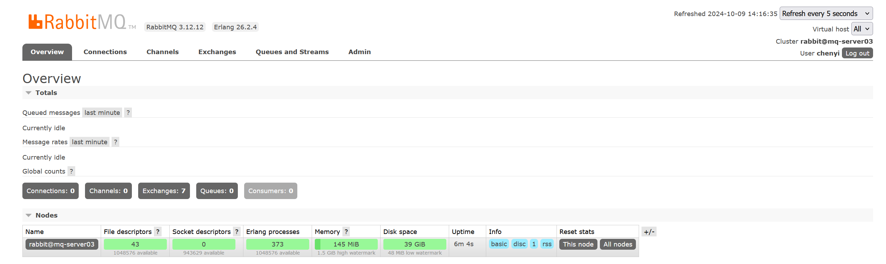
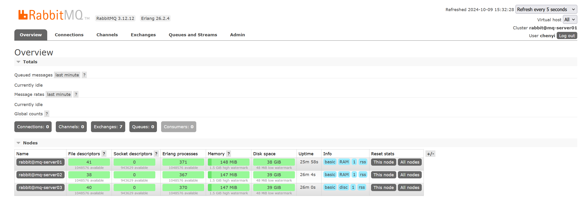

# RabbitMQ集群模式部署

## 1.高可用集群方案

RabbitMQ的集群主要有两种模式：普通集群模式和镜像模式。

1. **普通集群模式**：集群中各个节点之间只会相互同步元数据，消息数据不会被同步。不论是生产者还是消费者，假如连接到的节点上没有存储队列数据，那么内部会将其转发到存储队列数据的节点上进行存储。虽然说内部可以实现转发，但是因为消息仅仅只是存储在一个节点，所以这种普通集群模式并没有达到高可用的目的。
2. **镜像模式**：把需要的队列做成镜像队列，存在于多个节点，属于 RabbitMQ 的 HA 方案（镜像模式是在普通模式的基础上，增加一些镜像策略）该模式解决了普通模式中的数据丢失问题，其实质和普通模式不同之处在于，消息实体会主动在镜像节点间同步，而不是在 consumer 取数据时临时拉取，该模式带来的副作用也很明显，除了降低系统性能外，如果镜像队列数量过多，加之大量的消息进入，集群内部的网络带宽将会被这种同步通讯大大消耗掉，所以在对可靠性要求较高的场合中适用，一个队列想做成镜像队列，需要先设置 policy，然后客户端创建队列的时候，rabbitmq 集群根据“队列名称”自动设置是普通集群模式或镜像队列。

集群中有两种节点类型：

1. 内存节点：只将数据保存到内存
2. 磁盘节点：保存数据到内存和磁盘。

>内存节点虽然不写入磁盘，但是它执行比磁盘节点要好，集群中，只需要一个磁盘节点来保存数据就足够了如果集群中只有内存节点，那么不能全部停止它们，否则所有数据消息在服务器全部停机之后都会丢失。

推荐设计架构：

>在一个 rabbitmq 集群里，有 3 台或以上机器，其中 1 台使用磁盘模式，其它节点使用内存模式，内存节点无访问速度更快，由于磁盘 IO 相对较慢，因此可作为数据备份使用。

## 2.集群资源规划

| os             | hostname    | ip            |
| -------------- | ----------- | ------------- |
| ubuntu 22.04.3 | mq-server01 | 192.168.1.131 |
| ubuntu 22.04.3 | mq-server02 | 192.168.1.132 |
| ubuntu 22.04.3 | mq-server03 | 192.168.1.133 |

## 3.基础环境检查

>:bell:**以下步骤在所有主机上执行**

### 3.1.下载软件

>:mag:Erlang：https://github.com/erlang/otp/releases/download/OTP-26.2.4/otp_src_26.2.4.tar.gz
>
>:mag:RabbitMQ：https://github.com/rabbitmq/rabbitmq-server/releases/download/v3.12.12/rabbitmq-server-generic-unix-3.12.12.tar.xz

~~~shell
root@mq-server02 /opt:~ # wget https://github.com/erlang/otp/releases/download/OTP-26.2.4/otp_src_26.2.4.tar.gz

root@mq-server02 /opt:~ # wget https://github.com/rabbitmq/rabbitmq-server/releases/download/v3.12.12/rabbitmq-server-generic-unix-3.12.12.tar.xz

## 安装依赖 GCC 和 make 工具来编译源代码，以及一些基础库。
root@mq-server02 /opt/otp_src_26.2.4:~ # apt update
root@mq-server02 /opt/otp_src_26.2.4:~ # apt install -y build-essential tcl

## 对于 Ubuntu/Debian 系统，运行：
root@mq-server02 /opt/otp_src_26.2.4:~ # apt install -y libncurses5-dev libncursesw5-dev pkg-config  libssl-dev libncurses5-dev libgl1-mesa-dev libglu1-mesa-dev default-jdk unixodbc-dev xsltproc fop libxml2-utils

## 对于 CentOS/RHEL 系统，运行：
yum install ncurses-devel
~~~

### 3.2.目前权限基础

| 文件系统   | 备注         | 格式化类型 | 容量 | 所属用户         | 所属用户组       | 权限 |
| ---------- | ------------ | ---------- | ---- | ---------------- | ---------------- | ---- |
| /appbackup | 备份目录     | XFS        | 50G  | rabbitmq（2579） | rabbitmq（2579） | 755  |
| /app       | 应用程序目录 | XFS        | 10G  | rabbitmq（2579） | rabbitmq（2579） | 755  |

~~~shell
## 主机名解析配置
root@mq-server03 /opt:~ # cat >> /etc/hosts << EOF
192.168.1.131 mq-server01
192.168.1.132 mq-server02
192.168.1.133 mq-server03
EOF
~~~

~~~shell
## 1.创建用户和组
root@mq-server02 /opt:~ # groupadd -g 2579 rabbitmq
root@mq-server02 /opt:~ # useradd -u 2579 -g 2579 rabbitmq
root@mq-server02 /opt:~ # id rabbitmq
uid=2579(rabbitmq) gid=2579(rabbitmq) groups=2579(rabbitmq)

## 2.创建目录
root@mq-server02 /opt:~ #  mkdir -pv /app /app/erlang  /appbackup

## 3.创建文件系统
root@mq-server02 /opt:~ #  vgcreate  datavg /dev/sdb /dev/sdc
root@mq-server02 /opt:~ #  lvcreate  -L 200G -n lv_app datavg 
root@mq-server02 /opt:~ #  mkfs.xfs /dev/datavg/lv_appbackup

## 4.挂载忽略
.......

## 5.授权
root@mq-server02 /opt:~ # chown -R rabbitmq:rabbitmq /app /appbackup
~~~

## 4.解压安装程序

### 4.1.安装Erlang依赖

~~~shell
root@mq-server02 /opt:~ # tar xvf otp_src_26.2.4.tar.gz 
root@mq-server02 /opt:~ # cd /opt/otp_src_26.2.4

## 编译安装erlang
root@mq-server02 /opt/otp_src_26.2.4:~ # ./configure prefix=/app/erlang
root@mq-server02 /opt/otp_src_26.2.4:~ # make && make install PREFIX=/app/erlang

## 配置环境变量
root@mq-server02 /app/erlang:~ # cat > /etc/profile.d/erlang.sh << "EOF"
export ERLANG_HOME=/app/erlang
export PATH=$PATH:$ERLANG_HOME/bin
EOF

root@mq-server02 /app/erlang:~ # source /etc/profile.d/erlang.sh

## 验证
root@mq-server02 /app/erlang:~ # er
era_check       era_dump        era_invalidate  era_restore     erl             erlc  
~~~

### 4.2.安装RabbitMQ

~~~shell
root@mq-server02 /opt:~ # tar xvf /opt/rabbitmq-server-generic-unix-3.12.12.tar.xz -C /app/
root@mq-server02 /app:~ # cd /app
root@mq-server02 /app:~ # mv rabbitmq_server-3.12.12/ rabbitmq-3.12.12/    
root@mq-server02 /app:~ # cd rabbitmq-3.12.12/

## 配置环境变量
root@mq-server02 /app/rabbitmq-3.12.12:~ # cat > /etc/profile.d/rabbitmq.sh << "EOF"
export RABBITMQ_HOME=/app/rabbitmq-3.12.12
export PATH=$PATH:$RABBITMQ_HOME/sbin
EOF

root@mq-server02 /app/rabbitmq-3.12.12:~ # . /etc/profile.d/rabbitmq.sh
root@mq-server02 /app/rabbitmq-3.12.12:~ # rabbitmq
rabbitmq-defaults     rabbitmq-env          rabbitmq-queues       rabbitmq-streams      rabbitmqctl         
rabbitmq-diagnostics  rabbitmq-plugins      rabbitmq-server       rabbitmq-upgrade
~~~

## 5.启动RabbitMQ

~~~shell
## 以后台方式启动
root@mq-server02 /app/rabbitmq-3.12.12:~ # rabbitmq-server -detached

## rabbitmq默认安装启动以后，是没有开启web管理界面的，通过rabbitmq-plugins list命令可列出插件的启用和禁用状态。
root@mq-server03 /app:~ # rabbitmq-plugins enable rabbitmq_management

## 默认rabbitmq的账户只能localhost访问，因此添加一个账户，能外网访问 ( user password )
root@mq-server02 /app/rabbitmq-3.12.12:~ # rabbitmqctl add_user chenyi mmban

## 给账户添加administrator权限 
root@mq-server02 /app/rabbitmq-3.12.12:~ # rabbitmqctl set_user_tags chenyi administrator

## 设置任何ip都能访问
root@mq-server02 /app/rabbitmq-3.12.12:~ # rabbitmqctl set_permissions -p / chenyi ".*" ".*" ".*"
~~~

>:mag:访问：IP:15672

## 6.创建RabbitMQ集群

1.  RabbitMQ集群可以使得在RabbitMQ节点宕机时，消费者和生产者可以继续运行；并且可以承载更多的业务量增加系统吞吐量。
2. Rabbitmq 的集群是依赖于 erlang 的集群来工作的，所以必须先构建起 erlang 的集群环境,而 Erlang 的集群中各节点是通过一个 magic cookie 来实现的，这个cookie 存放在 /var/lib/rabbitmq/.erlang.cookie 中，文件是 400 的权限,所以必须保证各节点 cookie 保持一致，否则节点之间就无法通信。

>- 关闭所有RabbitMQ服务

~~~shell
## 关闭
root@mq-server01 /root:~ # rabbitmqctl stop_app
Stopping rabbit application on node rabbit@mq-server01 ...

## 在 mq-server01 同步.erlang.cookie 至其他两台服务器
root@mq-server01 /root:~ # scp /root/.erlang.cookie 192.168.1.132:/root/.erlang.cookie
root@mq-server01 /root:~ # scp /root/.erlang.cookie 192.168.1.133:/root/.erlang.cookie
~~~

>- 在 mq-server01 作为内存节点添加到 mq-server03，并作为内存节点,在 mq-server01执行以下命令

~~~shell
## 停止 app 服务
root@mq-server01 /root:~ # rabbitmqctl stop_app

## 清空元数据
root@mq-server01 /root:~ # rabbitmqctl reset
Resetting node rabbit@mq-server01 ...

## 将 rabbitmq-server01 添加到集群当中，并成为内存节点，不加--ram 默认是磁盘节点.
root@mq-server01 /root:~ # rabbitmqctl join_cluster rabbit@mq-server03 --ram
Clustering node rabbit@mq-server01 with rabbit@mq-server03

##重新启动rabbitmq
root@mq-server01 /root:~ # rabbitmqctl start_app
Starting node rabbit@mq-server01 ...
~~~

>- 在 mq-server02 作为内存节点添加到 mq-server03，并作为内存节点，在 mq-server02执行以下命令

~~~shell
## 停止 app 服务
root@mq-server02 /root:~ # rabbitmqctl stop_app
Stopping rabbit application on node rabbit@mq-server02 ...

## 清空元数据
root@mq-server02 /root:~ # rabbitmqctl reset
Resetting node rabbit@mq-server02 ...

## 将rabbitmq-server02 添加到集群当中
root@mq-server02 /root:~ # rabbitmqctl join_cluster rabbit@mq-server03 --ram
Clustering node rabbit@mq-server02 with rabbit@mq-server03

## 启动
root@mq-server02 /root:~ # rabbitmqctl start_app
Starting node rabbit@mq-server02 ...
~~~

>- 将集群设置为镜像模式，只要在其中一台节点执行以下命令即可：

~~~shell
root@mq-server03 /root:~ # rabbitmqctl set_policy ha-all "#" '{"ha-mode":"all"}'
Setting policy "ha-all" for pattern "#" to "{"ha-mode":"all"}" with priority "0" for vhost "/" ...
~~~

>- 验证当前集群状态

~~~shell
root@mq-server03 /root:~ # rabbitmqctl cluster_status
~~~

>- web界面验证当前集群状态

